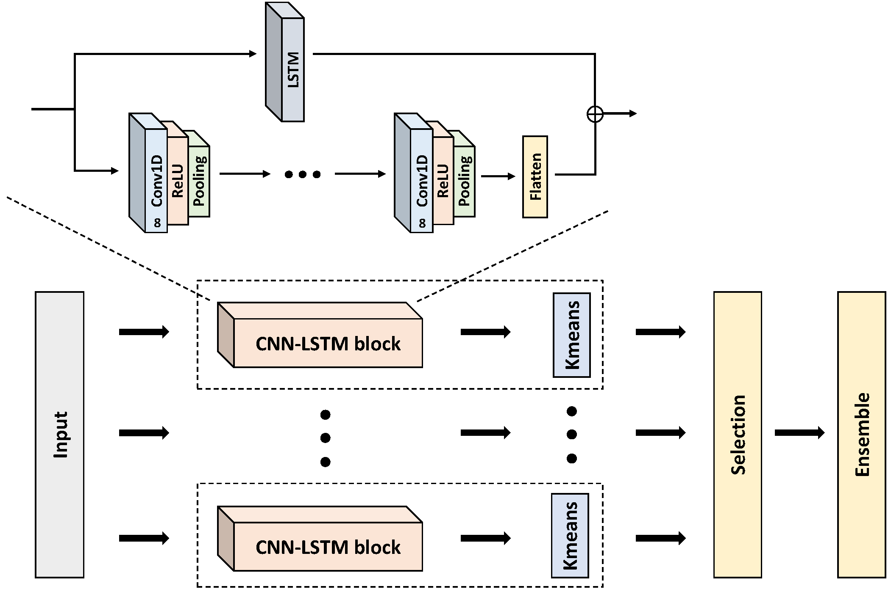

# RandomNet: Clustering Time Series Using Untrained Deep Neural Networks
RandomNet is a highly accurate and efficient time series clustering method. It has linear time complexity w.r.t the number of instances and the time series length. It not only achieves the SOTA performance but also performs well across all tested time series data types (device, ECG, EOG, EPG, image, motion, sensor, spectro, etc.).



## This [[paper]]() is accepted by DMKD!

### Prerequisites
- Python 3.8
- NumPy
- TensorFlow 2.1
- PyMetis
- Scikit-learn
- Linux system

### Installation
Install the required packages:
```sh
pip install -r requirements.txt
```
### Dataset
We use the UCR Time Series Classification Archive. You can download the full UCR datasets from [[here]](https://www.cs.ucr.edu/~eamonn/time_series_data_2018/).

### Running the Model
To run the model on the Coffee dataset:
```sh
python RandomNet.py --dataset Coffee
```
### Cite this work
Coming soon
